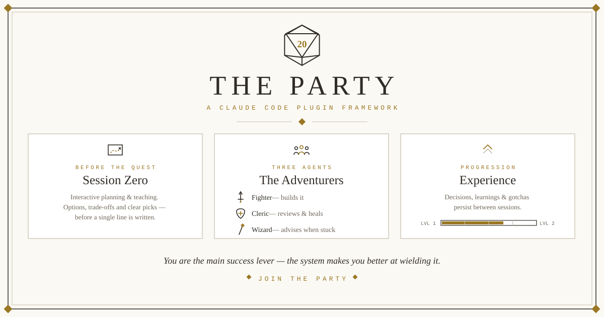

# Adventure Party

<p align="center">
  
</p>

An adventuring party and experience system for
[Claude Code](https://claude.com/claude-code), packaged as the **`party`
plugin**. You bring the quest; the party ships it.

## Install

One step. Installing the plugin gets you the party, session zero, and the
experience system.

Within the Claude session, add the marketplace and install the plugin:

```
/plugin marketplace add skeggsguy/adventure-party
/plugin install party@adventure-party
```

Pick a scope when `/plugin install` asks:

- **User** (the default) — the party is on call in **every** project on
  this machine. Right for solo work and for trying it out.
- **Project** — the party ships with **this** repo, for team use. Choosing
  "Project" writes it into the repo's `.claude/settings.json`.

  Teammates opening the repo are prompted once to add the marketplace;
  after that the plugin loads automatically for them.

Wherever it is installed, the party is on: the plugin feeds its
instructions into every session as it starts, and those instructions send
the party to read your project's own experience files, if it has any, at the
moments each one matters.

**Upgrading** — Two options either (1) put auto update on within the settings
in Claude marketplace for this plugin. OR (2) periodically refresh the
marketplace directly and then refresh the plugin as a second step.

## The premise

Adventure Party is built for people who are smart and intellectually
driven, and on the conviction that successful AI development hinges on three things:

1. **The dialogue** — the human conversation with the agent, where you
   learn, brainstorm, and land decisions you actually understand.
2. **Agentic orchestration** — where multiple agents build, test,
   review and ship the plan. Agent instructions are loosely coupled as not to
   constrain better and better models, and compliance enforced through
   unit testing and agentic review.
3. **Leveling up** — You learn, the AI learns. Learnings should be recorded
   and curated into experience, so they compound instead of evaporating.

Other frameworks install process and assume engineering literacy, or
remove decisions and assume expertise. 

Adventure Party installs process **and teaches the literacy as you go**: 
trade-offs explained in plain language where they're used, 
delegation made legible through party roles, and every landed decision 
written down with its reasons. 

You are the main success lever. The system's job is to make you better at
wielding it.

## The workflow

1. **Session Zero** — a real multi-turn conversation shapes every
   change that involves choosing an approach, before any code: what the
   options actually are, plain-language trade-offs, options with a
   recommendation, you make the calls (`/party:session-zero`). It runs
   as long as you're still thinking.
2. **Plan mode** — "let's plan mode this." The technical design, where
   you can and should orchestrate adversarial agents to challenge it
   (a UI challenge, a database-design challenge…).
3. **The party musters and executes** — on your command or your
   approved plan. Fighter builds, cleric reviews and heals, wizard
   advises on the hard calls. Any of the three seats can be filled by
   another vendor's coding CLI instead (`/party:hire`).
4. **Results come back to you** — review and feedback before you sign
   off the commit.
5. **New adventure, new session** — and the experience system carries
   what was learned.
6. **Long rest** — learnings are captured in every session. When enough
   have piled up you take a Long Rest, and they are sorted into
   architecture, decisions and gotchas which are readable by Claude. You
   level up, AI levels up.

## The party

One agent doing everything means one context doing everything: the model
that wrote the code reviews the code, believes its own report, and moves
on. Splitting the work across specialized agents buys real separation —
the reviewer reads the actual diff instead of trusting the builder's
summary.

The main session is **the Guide**: it runs the dialogue, assigns the quests, and 
is the only one that talks to you.

| Agent           | Role                    | Model | Effort | Access                 | May call                                          |
| --------------- | ----------------------- | ----- | ------ | ---------------------- | ------------------------------------------------- |
| `party:fighter` | Builder                 | Opus  | high   | full tools             | `Explore` recon, `party:wizard`, verifiers        |
| `party:cleric`  | Reviewer + fixer        | Fable | high   | full tools             | a verifier per finding, `party:wizard`, `Explore` |
| `party:wizard`  | Advisor (deep judgment) | Fable | xhigh  | read-only (no writes)  | nobody — deliberately                             |

**Fighter** ships a substantial implementation end-to-end —
implementation and tests, running the project's suite as it goes. In
a repo with no suite at all it writes the first test file and records
the command in your CLAUDE.md. Deliberately loose otherwise — it's a 
powerhorse, not a checklist-follower.

**Cleric** always runs after fighter, it reviews the actual diff
and the report from fighter, then directly heals what it finds — 
bugs, pinned-invariant violations, test gaps, convention drift, 
needless complexity — and leaves the tree green, driving any user-facing 
surface the way a user would. 

**Wizard** is the party's high-effort judgment: deep review, hard
debugging (2+ failed attempts), and which-approach calls. Wizard
is expensive and slow but valuable exactly when the repo needs it
most. Solves for try and fail re-attempts.

### The muster protocol

**The party musters on command, not by default.** The Guide does
ordinary work itself. The party rides out only if you summon it,
you accept a suggestion from the guide, or on execution of plan mode.

### Hirelings

You may already pay for another vendor's coding CLI. Any of the three party
roles can be **hired out** to one: `/party:hire fighter <cli>`, and from the
next muster fighter's quests run through that command instead. Leave out one
or both arguments and it walks you through the missing choices with
clickable options. `/party:hire fighter` releases it. One command each way.

A hire is standing configuration, not a one-off summons — it is recorded in
your repo's `.claude/party.json` and read at muster time, so it holds across
sessions until you release it. Nothing else about the party changes: the
`party:hireling` adapter carries your project's experience files into the
prompt the foreign CLI receives, reads the real diff afterwards instead of
trusting the CLI's own account, and reports back in that role's own handoff
contract — so a hired fighter still hands off to cleric, and cleric reviews
it exactly as before. If the hired command breaks, the quest stops and the
finding comes back to you with `/party:hire` as the repair — falling back to
the party's own member is your call, never the Guide's.

`/party:hire` guides you through clickable choices rather than typed
answers. The CLIs offered are the ones actually installed on your machine;
model names come from the CLI's own listing, with a web search only if it
has no listing. With your say-so, each smoke test makes a real call on your
subscription; it pins the model and, when the CLI offers one, reasoning
effort into the stored command by default — you can decline either — and
smoke-tests the exact final command before writing config. It will never
tell you which CLI or model to hire; that call is yours.

Two things it tells you once, at hire time, and they are worth repeating
here:

- The hired command writes to your repo **outside Claude Code's permission
  prompts**. You are approving the tool, not each edit it makes.
- Hiring **wizard** trades a guarantee for a promise: the party's wizard is
  read-only because it holds no write tools at all, while a hired wizard is
  read-only because a flag says so — the hireling checks afterwards for
  writes and reports any it finds.

## Session Zero

How quests get written at that table is itself part of the framework:
the **`/party:session-zero`** skill. It is exploration and chat mode — an
iterative dialogue the Guide runs *before* plan mode or code, built for
users who are smart and opinionated but didn't grow up in app
development.

Its core moves: options **with** a recommendation; what a tool or 
framework *actually is* before any verdict on using it — the category, 
the problem it was built for, and which decisions it takes off your plate 
in exchange for its opinions; YAGNI held as the default, because a wrong 
abstraction is a rewrite where duplicated code is only a refactor; 
tables and ASCII sketches where they carry structure prose carries badly; 
every term defined the first time it appears; clarifying questions batched 
early and only when the answer changes something; musings answered with 
assessment rather than action.

## The experience system

Agents are only as good as what the project tells them — so the party's
memory is its **experience**, and it levels up. Four files under
`.claude/` in your own repo hold it:

- `architecture.md` — how the system actually fits together (curated; read
  before planning, or before changing how parts fit)
- `gotchas.md` — non-obvious traps, 1–2 lines each, deleted when fixed
  (curated; read before the first edit, a one-line one included)
- `decisions.md` — why A over B, ~2 lines each, newest first (curated; read
  before choosing between approaches; the full argument lives in the archive)
- `learnings.md` — the **inbox**: an append-only log of surprises, read only
  when the curated three don't answer it, emptied by the Long Rest (below)

Nothing is force-fed into the session — each file is read at the moment it
can change what happens next. The split still matters: the curated three stay
small because they are read often and every read costs context, while the
inbox can grow because nothing opens it until something asks for it.

Nothing here is scaffolded into your repo up front and nothing is copied
out of the plugin: the party's own instructions come from the plugin at
the start of every session — so upgrading the plugin upgrades every
project — and those instructions are what point the party at your curated
files once they exist. The Guide creates each file the first time it has
something to write there.

## Leveling up — the Long Rest

`/party:long-rest` is the ceremony, and it is not fireworks: a Long
Rest is the moment the party *trains*. When the inbox reaches ten
entries the Guide mentions it, once — resting is always your call.

1. It distills the inbox into the curated files the party reads at their
   triggers, prunes what has stopped being true, compacts what has outgrown
   its budget — the full argument moves to `learnings-archive.md`, the live
   entry keeps the claim — then archives the processed entries and leaves
   the inbox empty. It also tells you what those curated files now cost to
   read, every rest: distilling grows them, so the same ceremony is what
   bounds them. A leveled-up party is literally a better-informed party.
2. It appends the level to **`CHRONICLE.md`**: your project's saga in
   plain language — what was built, what was conquered, what *you*
   learned. Every rest is a level; the chronicle is the record of them.
3. It awards the party a title — seeded from your repo's name and the
   level: *your* project's Level 3 party is always, say, the Wardens of
   the Unbroken Build.

The player levels up too: the chronicle plus the decisions file is a
growing, readable record of your own understanding — the thing this
whole framework exists to build.

## Requirements & caveats

- Claude Code with plugin support and subagents; `model:`/`effort:`
  frontmatter values are Anthropic model tiers (`opus`, `fable`) —
  change them in `.claude/party.json` to match what your plan offers.
- The session-start hook runs a single one-line `cat` through a POSIX shell.

## Roadmap

- Submit `party` to a community plugin marketplace so it installs without
  adding this repo as a marketplace first.
- **The Thief** — red team: sets up local experiment, plants secrets and
  attempts to steal your app's data and reports how it got in. Test your
  security for real.
- **The Artificer** — refactors, optimizes, and prepares you for production.

## License

MIT — see [LICENSE](LICENSE).
