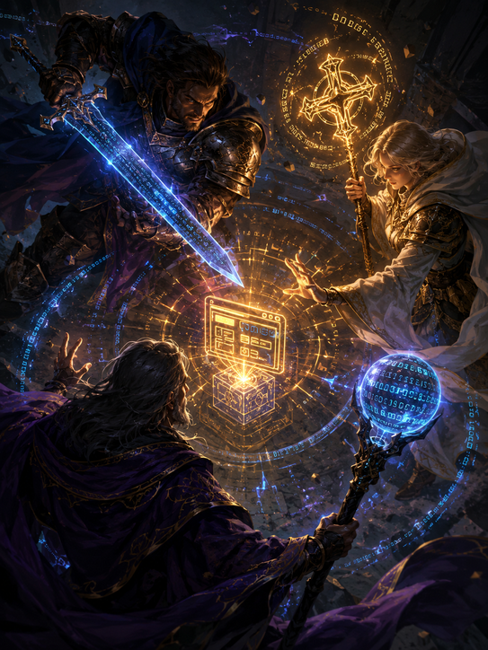

# Adventure Party

<p align="center">
  
</p>

An adventuring party and experience system for
[Claude Code](https://claude.com/claude-code), packaged as the **`party`
plugin**. You bring the quest; the party ships it.

## Install

One step. Installing the plugin gets you the party, session zero, and the
experience system — there is nothing to run per project, and nothing is
copied into your repo. Works on a new or existing repo.

Within the Claude session, add the marketplace and install the plugin:

```
/plugin marketplace add skeggsguy/adventure-party
/plugin install party@adventure-party
```

Pick a scope when `/plugin install` asks:

- **User** (the default) — the party is on call in **every** project on
  this machine. Right for solo work and for trying it out.
- **Project** — the party ships with **this** repo, for team use. Choosing
  "Project" writes it into the repo's `.claude/settings.json`.

  Teammates opening the repo are prompted once to add the marketplace;
  after that the plugin loads automatically for them.

Wherever it is installed, the party is on: the plugin feeds its
instructions — and your project's own experience files, if it has any —
into every session as it starts.

**Upgrading** — Two options either (1) put auto update on within the settings
in Claude marketplace for this plugin. OR (2) periodically refresh the
marketplace directly and then refresh the plugin as a second step.

Then restart the session — plugin skills and the session-start hook are
read at launch.

## The premise

Adventure Party is built for people who are smart and intellectually
driven but weren't full-stack developers before the genesis of AI — and on the
conviction that successful AI development hinges on three things:

1. **The dialogue** — the human conversation with the agent, where you
   learn, brainstorm, and land decisions you actually understand.
2. **Agentic orchestration** — where multiple agents build, test,
   review and ship the plan. Agent instructions are loosely coupled as not to
   constrain better and better models, and compliance enforced through
   unit testing and agentic review.
3. **Leveling up** — You learn, the AI learns. Learnings should be recorded
   and curated into experience, so they compound instead of evaporating.

Other frameworks install process and assume engineering literacy, or
remove decisions and assume expertise. 

Adventure Party installs process **and teaches the literacy as you go**: 
trade-offs explained in plain language where they're used, 
delegation made legible through party roles, and every landed decision 
written down with its reasons. 

You are the main success lever. The system's job is to make you better at
wielding it.

## The workflow

1. **Session Zero** — a real multi-turn conversation shapes every
   change that involves choosing an approach, before any code: what the
   options actually are, plain-language trade-offs, options with a
   recommendation, you make the calls (`/party:session-zero`). It runs
   as long as you're still thinking.
2. **Plan mode** — "let's plan mode this." The technical design, where
   you can and should orchestrate adversarial agents to challenge it
   (a UI challenge, a database-design challenge…).
3. **The party musters and executes** — on your command or your
   approved plan. Fighter builds, cleric reviews and heals, wizard
   advises on the hard calls.
4. **Results come back to you** — review and feedback before you sign
   off the commit.
5. **New adventure, new session** — and the experience system carries
   what was learned.
6. **Level up** — learnings are captured in every session. When enough
   have piled up you take a Long Rest, and they are sorted into
   architecture, decisions and gotchas which are readable by Claude. You
   level up, AI levels up.

## The party

One agent doing everything means one context doing everything: the model
that wrote the code reviews the code, believes its own report, and moves
on. Splitting the work across specialized agents buys real separation —
the reviewer reads the actual diff instead of trusting the builder's
summary.

The main session is **the Guide**: it runs the dialogue, assigns the quests, and 
is the only one that talks to you.

| Agent           | Role                    | Model | Effort | Access                 | May call                                          |
| --------------- | ----------------------- | ----- | ------ | ---------------------- | ------------------------------------------------- |
| `party:fighter` | Builder                 | Opus  | high   | full tools             | `Explore` recon, `party:wizard`, verifiers        |
| `party:cleric`  | Reviewer + fixer        | Fable | high   | full tools             | a verifier per finding, `party:wizard`, `Explore` |
| `party:wizard`  | Advisor (deep judgment) | Fable | xhigh  | read-only (no writes)  | nobody — deliberately                             |

**Fighter** ships a substantial implementation end-to-end —
implementation and tests, running the project's suite as it goes. In
a repo with no suite at all it writes the first test file and records
the command in your CLAUDE.md. Deliberately loose otherwise — it's a 
powerhorse, not a checklist-follower.

**Cleric** always runs after fighter, it reviews the actual diff
and the report from fighter, then directly heals what it finds — 
bugs, pinned-invariant violations, test gaps, convention drift, 
needless complexity — and leaves the tree green, driving any user-facing 
surface the way a user would. 

**Wizard** is the party's high-effort judgment: deep review, hard
debugging (2+ failed attempts), and which-approach calls. Wizard
is expensive and slow but valuable exactly when the repo needs it
most. Solves for try and fail re-attempts.

### The muster protocol

**The party musters on command, not by default.** The Guide does
ordinary work itself. The party rides out only on one of three triggers:

- You explicitly summon it.
- A plan-mode plan is approved — **plans muster by default**: every plan
  ends with an Execution section naming who runs each phase, fighter
  building and cleric reviewing unless you said otherwise while
  planning.
- You accept the Guide's suggestion — it may offer, once and in one
  line, when work looks party-sized, and takes no for an answer.

Planning is deliberately **not** a party member: planning is a dialogue
with the human, and subagents can't talk to the human. The quest gets
written at the Guide's table; the party executes it.

Default models are set per agent; to change them, edit
`.claude/party.json` in your project — put `fighter`, `cleric` or
`wizard` under `models`, set to a tier (`opus`, `sonnet`, `haiku`,
`fable`). The Guide passes your choice at spawn time, which outranks the
agent file's default.

## Session Zero

How quests get written at that table is itself part of the framework:
the **`/party:session-zero`** skill. It is exploration and chat mode — an
iterative dialogue the Guide runs *before* plan mode or code, built for
users who are smart and opinionated but didn't grow up in app
development.

Its core moves: options **with** a recommendation (and the strongest case
against it); what a tool or framework *actually is* before any verdict on
using it — the category, the problem it was built for, and which
decisions it takes off your plate in exchange for its opinions; YAGNI
held as the default, because a wrong abstraction is a rewrite where
duplicated code is only a refactor; tables and ASCII sketches where they
carry structure prose carries badly; every term defined the first time
it appears; clarifying questions batched early and only when the answer
changes something; musings answered with assessment rather than action.

Depth tracks **stakes × reversibility** — a naming question gets a
sentence, a dependency you'll build on gets the full treatment. The
dialogue has no exit condition except your word: the Guide never moves
to plan mode on its own initiative, and circling back to the same call
from a new angle is the mode working as intended. Every landed decision
is recorded with its why in the project's decisions file, so the
learning compounds. The user makes the calls, informed.

## The experience system

Agents are only as good as what the project tells them — so the party's
memory is its **experience**, and it levels up. Four files under
`.claude/` in your own repo hold it:

- `architecture.md` — how the system actually fits together (curated,
  loaded every session)
- `gotchas.md` — non-obvious traps, 1–2 lines each, deleted when fixed
  (curated, loaded every session)
- `decisions.md` — why A over B, newest first (curated, loaded every
  session)
- `learnings.md` — the **inbox**: an append-only log of surprises,
  never loaded, read on demand and emptied by the Long Rest (below)

The split matters: curated files stay small because they cost context on
every prompt; the inbox can grow because it's read only when something
asks for it.

Nothing here is scaffolded into your repo up front and nothing is copied
out of the plugin: the party's own instructions come from the plugin at
the start of every session — so upgrading the plugin upgrades every
project — and the curated files ride in alongside them once they exist.
The Guide creates each file the first time it has something to write
there.

## Leveling up — the Long Rest

`/party:consolidate` is the ceremony, and it is not fireworks: a Long
Rest is the moment the party *trains*. When the inbox reaches ten
entries the Guide mentions it, once — resting is always your call.

1. It distills the inbox into the curated files that load every session,
   prunes what has stopped being true, then archives the processed
   entries to `learnings-archive.md` and leaves the inbox empty. A
   leveled-up party is literally a better-informed party.
2. It appends the level to **`CHRONICLE.md`**: your project's saga in
   plain language — what was built, what was conquered, what *you*
   learned. Every rest is a level; the chronicle is the record of them.
3. It awards the party a title — seeded from your repo's name and the
   level, so it is deterministic: *your* project's Level 3 party is
   always, say, the Wardens of the Unbroken Build. Their name, not a
   slot machine's.

The player levels up too: the chronicle plus the decisions file is a
growing, readable record of your own understanding — the thing this
whole framework exists to build.

## Requirements & caveats

- Claude Code with plugin support and subagents; `model:`/`effort:`
  frontmatter values are Anthropic model tiers (`opus`, `fable`) —
  change them in `.claude/party.json` to match what your plan offers.
- The session-start hook runs one `cat` through a POSIX shell. Verified
  on Linux and WSL; on Windows-native it is expected to work through Git
  Bash but is not yet verified — if the party's instructions never show
  up there, that is the thing to report.

## Roadmap

- Submit `party` to a community plugin marketplace so it installs without
  adding this repo as a marketplace first.
- **The Thief** — red team: sets up local experiment, plants secrets and
  attempts to steal your app's data and reports how it got in. Test your
  security for real.
- **The Artificer** — refactors, optimizes, and prepares you for production.

## License

MIT — see [LICENSE](LICENSE).
