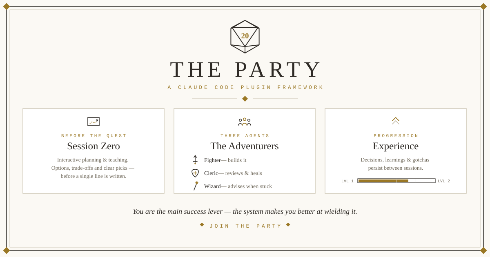

# Adventure Party

<p align="center">
  
</p>

An adventuring party and experience system for
[Claude Code](https://claude.com/claude-code), packaged as the **`party`
plugin**. You bring the quest; the party ships it.

## Note from the Creator

This plugin is actively updated from learnings made via a outer harness evaluation blog [Fresh Worktree](https://fresh-worktree.ghost.io/). Check it out if interested!

## Install

One step. Installing the plugin gets you the party, session zero, and the
experience system.

Within the Claude session, add the marketplace and install the plugin:

```
/plugin marketplace add skeggsguy/adventure-party
/plugin install party@adventure-party
```

Pick a scope when `/plugin install` asks:

- **User** (the default) — the party is on call in **every** project on
  this machine. Right for solo work and for trying it out.
- **Project** — the party ships with **this** repo, for team use. Choosing
  "Project" writes it into the repo's `.claude/settings.json`.

  Teammates opening the repo are prompted once to add the marketplace;
  after that the plugin loads automatically for them.

Wherever it is installed, the party is on: the plugin feeds its
instructions into every session as it starts, and those instructions send
the party to read your project's own experience files, if it has any, at the
moments each one matters.

**Upgrading** — Two options either (1) put auto update on within the settings
in Claude marketplace for this plugin. OR (2) periodically refresh the
marketplace directly and then refresh the plugin as a second step.

**Upgrading from 0.10 or earlier** — hirelings are retired. A `hired` entry
in `.claude/party.json` is now ignored and that role's own party member runs
instead; to put a role on another model, see Pinning models below.

## The premise

Adventure Party is built for people who are smart and intellectually
driven, and on the conviction that successful AI development hinges on three things:

1. **The dialogue** — the human conversation with the agent, where you
   learn, brainstorm, and land decisions you actually understand.
2. **Agentic orchestration** — where multiple agents build, test,
   review and ship the plan. Agent instructions are loosely coupled as not to
   constrain better and better models, and compliance enforced through
   unit testing and agentic review.
3. **Leveling up** — You learn, the AI learns. Learnings should be recorded
   and curated into experience, so they compound instead of evaporating.

Other frameworks install process and assume engineering literacy, or
remove decisions and assume expertise. 

Adventure Party installs process **and teaches the literacy as you go**: 
trade-offs explained in plain language where they're used, 
delegation made legible through party roles, and every landed decision 
written down with its reasons. 

You are the main success lever. The system's job is to make you better at
wielding it.

## How it fits together

Talk it through, plan it, let the party build and review it step by step,
get the results back — and every session leaves the project a bit smarter.

```text
You ─── small change ───► the Guide just does it
 │
 │ bigger work
 ▼
Session Zero ───► Plan mode
talk it through   steps, measures, Autonomous: yes/no
                      │
      ┌───────────────▼─ each step ───────────────┐
      │  fighter builds ───► cleric reviews       │
      │     ▲                    │                │
      │     └──── hand-back ─────┤                │
      │                          ▼                │
      │  checkpoint commit + a few lines to you   │
      └─────────────────────┬─────────────────────┘
                            │ after the last step
                            ▼
                         Debrief ───► You
                            │
                            ▼
                     learnings inbox
                            │ /party:long-rest
                            ▼
               experience files (.claude/)
                            │
                            ▼
             read by the party members (see The party)
```

## The party

One agent doing everything means the model that wrote the code also
reviews it and believes its own report. Splitting the roles means the
reviewer reads the actual diff. The main session is **the Guide**: it runs
the conversation, hands out the work, and is the only one that talks to you.

| Agent           | Job                                                                 | Default model | Effort |
| --------------- | ------------------------------------------------------------------- | ------------- | ------ |
| `party:fighter` | Builds each step, tests included                                    | `opus`        | high   |
| `party:cleric`  | Reviews each build against the plan; fixes what keeps the design, hands back the rest | `fable`       | high   |
| `party:wizard`  | Read-only second opinion for hard bugs and approach calls           | `fable`       | xhigh  |

The full instructions are short — read them in [`agents/`](agents/).

### Party or Guide

A simple change? The Guide just does it. For bigger work you summon the
party, accept the Guide's one-line suggestion, or approve a plan — plans use
the party by default.

Every plan says **`Autonomous: yes`** (the default) or **`no`**. With yes,
the party runs to the end on its own: anything cleric can't fix goes back
to fighter, then to wizard, and if it's still stuck it is set aside and the
run carries on; calls made on your behalf are listed in the debrief. With
no, it pauses and asks you whenever cleric hands something back. On a
multi-step plan each step is committed to a branch as it goes — merging
that branch is your sign-off.

### Pinning models

Defaults are in the table above. Pin a different tier per member in
`.claude/party.json` — for example cheaper, faster, lighter reviews:

```json
{ "models": { "cleric": "sonnet" } }
```

Values are tier names: `opus`, `sonnet`, `haiku` or `fable`. To change what
a tier actually runs — a different model, or traffic through a gateway or
router — use Claude Code's own
[model configuration](https://code.claude.com/docs/en/model-config) and
[LLM gateway](https://code.claude.com/docs/en/llm-gateway) settings; the
party follows whatever a tier points to. (Anthropic doesn't support
non-Claude models through a gateway.)

## Session Zero

How quests get written at that table is itself part of the framework:
the **`/party:session-zero`** skill. It is exploration and chat mode — an
iterative dialogue the Guide runs *before* plan mode or code, built for
users who are smart and opinionated but didn't grow up in app
development.

Its core moves: options **with** a recommendation; what a tool or 
framework *actually is* before any verdict on using it — the category, 
the problem it was built for, and which decisions it takes off your plate 
in exchange for its opinions; YAGNI held as the default, because a wrong 
abstraction is a rewrite where duplicated code is only a refactor; 
tables and ASCII sketches where they carry structure prose carries badly; 
every term defined the first time it appears; clarifying questions batched 
early and only when the answer changes something; musings answered with 
assessment rather than action.

At the time of writing, Fable or Opus 4.6 is recommended for Session Zero.

## The experience system

Agents are only as good as what the project tells them — so the party's
memory is its **experience**, and it levels up. Four files under
`.claude/` in your own repo hold it:

- `architecture.md` — how the system actually fits together (curated; read
  before planning, or before changing how parts fit)
- `gotchas.md` — non-obvious traps, 1–2 lines each, deleted when fixed
  (curated; read before the first edit, a one-line one included)
- `decisions.md` — why A over B, ~2 lines each, newest first (curated; read
  before choosing between approaches; the full argument lives in the archive)
- `learnings.md` — the **inbox**: an append-only log of surprises, read only
  when the curated three don't answer it, emptied by the Long Rest (below)

Nothing is force-fed into the session — each file is read at the moment it
can change what happens next. The split still matters: the curated three stay
small because they are read often and every read costs context, while the
inbox can grow because nothing opens it until something asks for it.

Nothing here is scaffolded into your repo up front and nothing is copied
out of the plugin: the party's own instructions come from the plugin at
the start of every session — so upgrading the plugin upgrades every
project — and those instructions are what point the party at your curated
files once they exist. The Guide creates each file the first time it has
something to write there.

## Leveling up — the Long Rest

`/party:long-rest` is when the party trains. When the learnings inbox
reaches ten entries the Guide mentions it once; resting is your call.

A rest distills the inbox into the curated files, trims what's stopped
being true or outgrown its budget (telling you what those files now cost
to read), and archives the rest. It then adds a level to **`CHRONICLE.md`**
— your project's saga: what was built, what *you* learned — and awards the
party a title seeded from your repo's name. The chronicle and the decisions
file together are a readable record of your own understanding.

## Requirements & caveats

- Claude Code with plugin support and subagents; `model:` frontmatter
  values are Anthropic model tiers (`opus`, `fable`) — pin other tiers in
  `.claude/party.json` to match what your plan offers (see Pinning
  models); `effort:` has no per-project override.
- In a project with a browser front end and no browser test tool, the
  first browser test adds Playwright to the project and downloads its
  browsers — a few hundred MB, shared across projects on that machine.
- The session-start hook runs a single one-line `cat` through a POSIX shell.

## Roadmap

- Submit `party` to a community plugin marketplace so it installs without
  adding this repo as a marketplace first.
- **The Thief** — red team: sets up local experiment, plants secrets and
  attempts to steal your app's data and reports how it got in. Test your
  security for real.
- **The Artificer** — refactors, optimizes, and prepares you for production.

## License

MIT — see [LICENSE](LICENSE).
